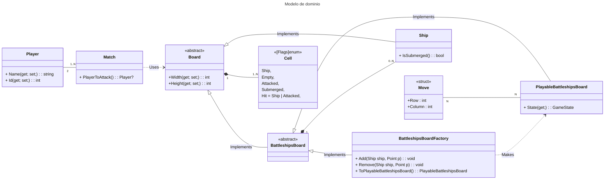

```mermaid

---
title: Modelo de dominio
---

classDiagram
    direction LR
    %% Classes

    class BattleshipsBoardFactory{
        + Add(Ship ship, Point p): void
        + Remove(Ship ship, Point p): void
        + ToPlayableBattleshipsBoard(): PlayableBattleshipsBoard
    }
    class BattleshipsBoard{
        <<abstract>>
    }
    class Board{
        <<abstract>>
        +Width(get; set;) : int
        +Height(get; set;) : int
    }
    class PlayableBattleshipsBoard{
        + State (get;): GameState
    }
    class Player{
        + Name (get; set;): string
        + Id (get; set;): int
    }
    class Cell{
        <<[Flags]enum>>
        Ship,
        Empty,
        Attacked,
        Submerged,
        Hit = Ship | Attacked,
    }
    class Ship{
        + IsSubmerged() : bool
    }
    class Match{
        + PlayerToAttack(): Player?
    }
    class Move{
        <<struct>>
        +Row : int
        +Column : int
    }


    %% Inheritance
    %% Character <|-- MagicalBeing
    BattleshipsBoard <|-- BattleshipsBoardFactory : Implements
    BattleshipsBoard <|-- PlayableBattleshipsBoard: Implements
    Board <|-- Ship : Implements
    Board <|-- BattleshipsBoard : Implements
    


    %% Realization
    %% ActionResult --|> Dwarf


    %% Association
    %% Spell "N" -- "N" MagicalBeing : Ejemplo de sintaxis. 
    Player "2" -- "1..N" Match
    Move "N" -- "N" PlayableBattleshipsBoard

    %% Composition
    %%Wizard "1" *-- "1" SpellBook
    Board "1" *-- "1..N" Cell
    BattleshipsBoard"1" *-- "0..N" Ship

    %% Aggregation
    %% SpellBook "1" --o "1" Wizard : Ejemplo de sintaxis

    %% Link
    %%Character "1" .. "1" Character : Attack

    %%Dependency
    %%classK ..> classL
    Match ..> Board : Uses

    BattleshipsBoardFactory ..> PlayableBattleshipsBoard: Makes

    %% Notes
    %%note for Stats "Inteligence, in wizards, determines magical capability.\n Strength ~= attack.\n Endurance ~= defence."

```
