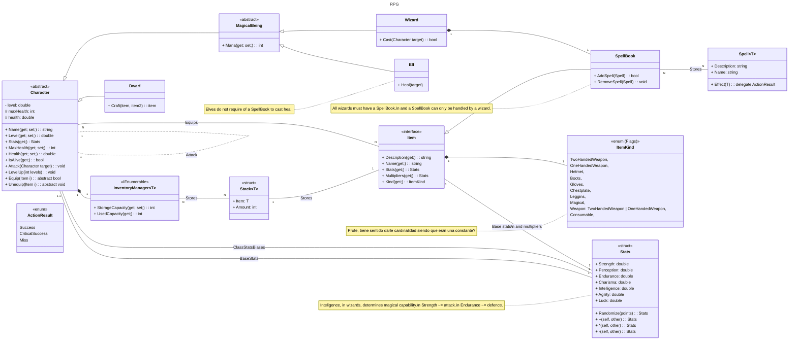

```mermaid

---
title: RPG
---

classDiagram
    direction LR
    %% Classes
    class Character {
        <<abstract>>
        + Name(get; set;): string
        - level: double
        + Level(get; set;): double
        + Stats(get;) Stats
        # maxHealth: int
        + MaxHealth(get; set;): int
        # health: double
        + Health(get; set;): double
        + IsAlive(get;): bool
        + Attack(Character target): void
        + LevelUp(int levels): void
        + Equip(Item i): abstract bool
        + Unequip(Item i): abstract void
    }
    class InventoryManager~T~ {
        <<IEnumerable>>
        + StorageCapacity(get; set;): int
        + UsedCapacity(get;): int
    }
    class Stack~T~ {
        <<struct>>
        + Item: T
        + Amount: int
    }
    class ActionResult {
        <<enum>>
        Success
        CriticalSuccess
        Miss
    }
    class SpellBook {
        + AddSpell(Spell): bool
        + RemoveSpell(Spell): void
    }
    class MagicalBeing {
        <<abstract>>
        + Mana(get; set;): int
    }
    class Wizard{
        + Cast(Character target): bool
    }
    class Spell~T~ {
        + Description: string
        + Name: string
        + Effect(T): delegate ActionResult
    }
    class Elf{
        + Heal(target)
    }
    class Dwarf{
        + Craft(item, item2): item
    }
    class Item {
        <<interface>>
        + Description(get;): string
        + Name(get;): string
        + Stats(get;): Stats
        + Multipliers(get;): Stats
        + Kind(get;): ItemKind
    }
    class ItemKind {
        <<enum (Flags)>>
        TwoHandedWeapon,
        OneHandedWeapon,
        Helmet,
        Boots,
        Gloves,
        Chestplate,
        Leggins,
        Magical,
        Weapon: TwoHandedWeapon | OneHandedWeapon,
        Consumable,
    }
    class Stats {
        <<struct>>
        + Strength: double
        + Perception: double
        + Endurance: double
        + Charisma: double
        + Intelligence: double
        + Agility: double
        + Luck: double
        + Randomize(points): Stats
        + +(self, other): Stats
        + *(self, other): Stats
        + -(self, other): Stats
    }

    %% Inheritance
    Character <|-- MagicalBeing
    MagicalBeing <|-- Elf
    MagicalBeing <|-- Wizard
    Character <|-- Dwarf
    Item <|-- SpellBook

    %% Realization
    %% ActionResult --|> Dwarf

    %% Association
    %% Spell "N" -- "N" MagicalBeing : Ejemplo de sintaxis.
    SpellBook "N" -- "N" Spell: Stores
    InventoryManager "N" -- "N" Stack: Stores
    Stack "1" -- "1" Item: Stores
    Character "N" -- "N" Item: Equips
    Character "1" -- "1" Stats: BaseStats
    Character "1" -- "1" Stats: ClassStatsBiases
    Item "1" -- "2" Stats: Base stats\n and multipliers

    %% Composition
    Wizard "1" *-- "1" SpellBook
    Character "1" *-- "1" InventoryManager
    Item "1" *-- "1" ItemKind

    %% Aggregation
    %% SpellBook "1" --o "1" Wizard : Ejemplo de sintaxis

    %% Link
    Character "1" .. "1" Character : Attack

    %% Notes
    note for Stats "Inteligence, in wizards, determines magical capability.\n Strength ~= attack.\n Endurance ~= defence."
    note for SpellBook "All wizards must have a SpellBook,\n and a SpellBook can only be handled by a wizard."
    note for Elf "Elves do not require of a SpellBook to cast heal."
    note for ItemKind "Profe, tiene sentido darle cardinalidad siendo que es\n una constante?"

```
asda
